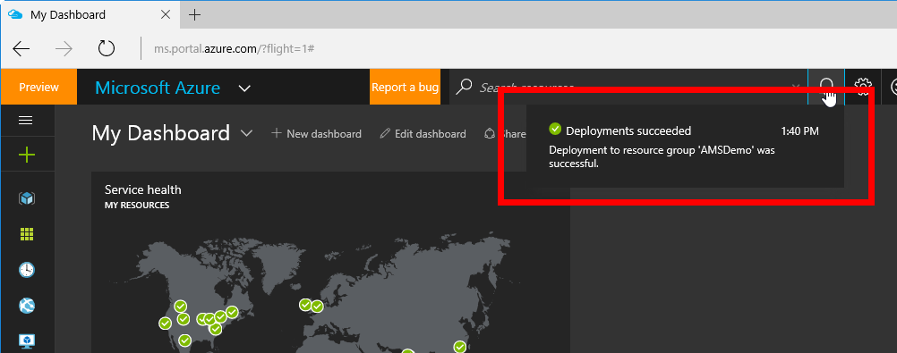
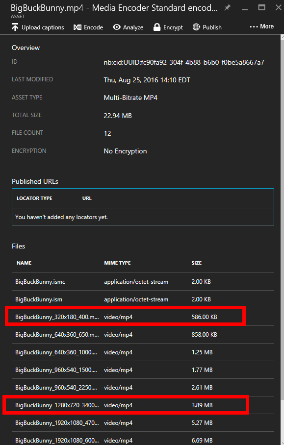

# Azure Media Services End to End Demo

This guide provides an introduction to some Visual Studio and Azure integration concepts.  In this demonstration you will show how to 
* Push changes from a local Git repository to Visual Studio Team Services
* Enable continuous integration (build) in VSTS

## Contents
* [Pre-Requisites](#pre)
* [Setup](#setup)
* [Demo Steps](#demo)
* [Clean Up](#clean)

##  Pre-Requisites
* Azure Subscrition

##  Setup
*Estimated Setup Time: 45 minutes*

1. To provision an Azure Media Services resource, login to the [Azure Portal](http://portal.azure.com)

1. Click **+ New** in the top left corner of the screen, then **Media + CDN** and finally **Media Services**

    

1. Add an **Account Name** for the Azure Media Services resource, selecting your **Subscription** and generating a new **Resource Group**. 

    

1. AMS requires an Azure Storage Account to hold video assets.  Click the **Storage Account** box, then **Create new** to open the creation blade.  Give a universally unique **Name** and choose **Locally-redundant storage (LRS)** to save some money.

    

    > Note: The storage account used with AMS must reside in the same region

1. Once all fields are filled out, click **Create** at the bottom of the blade to begin provisioning. 

    

1. Wait for the Azure Media Servies resource to be finish provisioning. This process may take up to 5 minutes. 

    

1. In a new tab, open the [Azure Media Player](http://aka.ms/azuremediaplayer)

    

Setup Completed.

##  Demo Steps
*Estimated Time: 8 minutes*

1. From the [Azure Portal](http://portal.azure.com) open the resource group created during setup and select the Azure Media Services resource.

    

1. First we need to upload a video asset.  From the blade, select **Assets**

    

1. Next, click **Upload** on the top toolbar

    

1. Open the file picker and select **BigBuckBunny.mp4** that is included in this repository under **SampleVideos**.  The file will automatically upload to the Azure Storage account, creating a new Asset.

    

1. Back on the Assets blade, click the newly uploaded **BigBuckBunny.mp4** row to see more details

    

1. This blade shows all of the related files for a given asset, in this case BigBuckBunny. Now that we have a video uploaded, we can encode the file in a variety of ways.  Click **Encode** from the top toolbar.

    

1. AMS includes two encoders, the Standard for general usage, and a Premium Encoder for sophisticated, custom media pipelines.  Keep the default **Media Encoder Standard**. 

1. Encoding Presets include a variety of the most common video formats, breaking down into two main groups: Multiple and Single.  Multiple will generate several versions of your video of varying sizes that target different form factors.  A smart video player can detect your device's speed and serve up the most appropriate version of the file, creating a better use experience.  However a Single bitrate may also be used, which is more simplistic and instead generates one single video file for when you know all target users will be on a standard device type.  

    Select **H264 Multiple Bitrate 4K** for the demo. 

    

1. The encoder works off a queue system, where jobs are processed incrementally.  Click **Create** to create an encoding job that will process our original video into a Multi-Bitrate set of files.

    

1. Click the **Encoding job added** notification to watch the encoder pick the job off the queue and process the file.

    

1. Wait for the job to complete, it should take less than 5 minutes. 

    

1. When finished, navigate back to the Assets blade and select the new asset **BigBuckBunny.mp4 - Media Encoder Standard**, noting how the file size is significantly larger than our original source video.

    

1. In the Asset Details blade, note how the encoder has generated several versions of the video in several resolutions - 320x180 for mobile up to 1920x1080 for large form factors. Also point out that the file size is larger because of these multiple variations.

    

1. The encoder worked fine for a single video, but what about if we had dozens or hundreds of videos to be encoded with a fast turnaround?  The queue used for the Encoder can be scaled up and out with a concept called **Reserved Units**.  To demonstrate, selected **Reserved Units** from the orginal AMS settings blade.

    

    *  Drag the **Media Reserved Units** slider to the right until **5** is visible.  This will allow up to 5 jobs to run in parallel.

    *  To scale up to a more performant machine, click **Speed of reserved processing units** and select the **S2** plan.  

    *  Click **Save** on the top taskbar to save changes, thus scaling the resource both up and out.  5 jobs could now be run at the same time and would complete in less time.

1.  Now that the video has been uploaded and encoded it is time for playback.  Back on the Assets blade, re-open the Encoded Asset.  On the top toolbar, select **Publish**, verifying that the Locator Type is set **Streaming**.  Click the checkbox at the bottom to setup a "Streaming Endpoint".

    

1. On the Asset blade a **Publish URL** will be setup within a few minutes.  Click the folder icon to the right to copy the URL to the clipboard.  This URL is used by players to stream the video file.

    

1. Open a browser tab to [Azure Media Player](http://aka.ms/azuremediaplayer) and paste the Publish URL into the "URL" box. The AMP is a cross-browser JavaScript solution that can handle a wide array of video types and configurations.  It is free to use for AMS projects, and can be easily integrated into websites, blogs, or SharePoint pages.  Once pasted in, click the **Update Player** button to refresh the player and begin playing the BigBuckBunny video. 

    

1.  Summarize taking a local video asset, uploading it to Azure Media Services, encoding it into a multi-bitrate set of videos, scaling out the AMS encoder, and streaming a published video asset via the free Azure Media Player.

Demo Completed.

##  Clean Up
To clean up this environment delete the Azure resource group you created in the Setup section. Do this quickly, as those scaled out Reserved Units are not cheap.